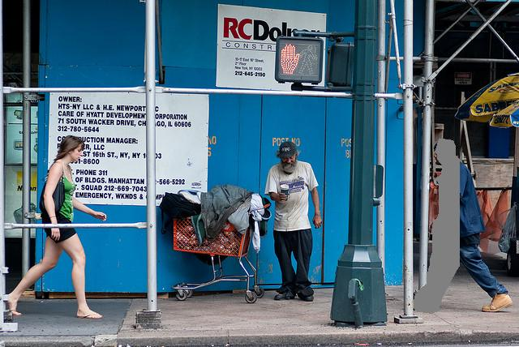
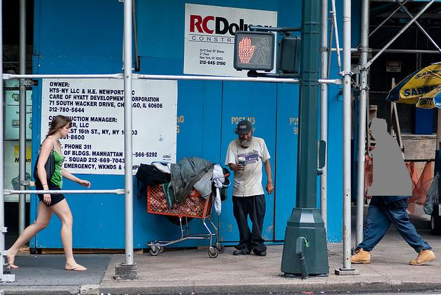

# Test model
This repository includes the implementation for inpainting test.

This repo is not yet complete.

## Availabe Metrics
In this test, the following metrics are evaluated.

- [X] L1 (SSL 1-1 metric)
- [X] L2
- [X] Structural SIMilarity (SSIM, SSL 2-3 metric)
- [X] Peak Signal-to-Noise Ratio (PSNR)
- [X] Learned Perceptual Image Patch Similarity (LPIPS, SSL 2-1 metric)
- [X] Inception Score (IS)
- [X] Frechet Inception Distance (FID, SSL 2-2 metric) 
- [ ] The size of the smallest part that can be reconstructed (SSL 1-2 metric, COCO and VG only) *
- [ ] Restoration success rate of noise / part deletion video (SSL 3 metric, COCO and VG only)

Note*: The ratio of the widest mask to the original that satisfies the L1 loss of 5% or less between the reconstructed image and the original image

## Requirements
please see [INSTALL.md](INSTALL.md).

## TODO
- [X] COCO validation with ours
- [X] VG validation with ours
- [X] validations with other methods
- [ ] Valdiations with other metrics
- [ ] Link for download test datasets

## Data Preparation
Download COCO dataset to datasets/coco
```bash
bash scripts/download_coco.sh
```
Download VG dataset to datasets/vg
```bash
bash scripts/download_vg.sh
python scripts/preprocess_vg.py
```

## Test

### Test Model

Run the test script:

```bash
python test_model.py \
--dataset [DATASET] --out_path [OUT_DIR] --ckpt_path [CKPT_DIR] --model_name [MODEL_NAME]
```

For example,

```bash
python test_model.py \
--dataset vg --out_path ./my_output --ckpt_path ./pretrained/triplegenerator.ckpt --model_name TripleGenerator_v2
```

#### Note for test your own model

please see [TEST.md](TEST.md).

### Test Samples

Run the test script:

```bash
python test_samples.py --dataset [DATASET] --real_path [DATASET PATH] --fake_path [FAKE PATH] --out_path [OUT PATH]
```
Note 1: Measuring IS or FID is recommended by generating more than 50,000 samples [WGAN-GP, TTUR]

Note 2: The data type is converted from float to uint8 when saving the image. For accurate measurement, use the [test_model.py](/test_model.py) whenever possible.

### Test Model with Categories

Run the test script:

```bash
python test_model_with_categories.py \
--dataset [DATASET] --out_path [OUT_DIR] --ckpt_path [CKPT_DIR] --model_name [MODEL_NAME]
```
Note: This test is for hallucinating visual instances with partial absentia.
In coco and vg, the object corresponding to the label index defined in each task is deleted from the image, and the object is restored by input index.

### Visualizing Qualitative Comparisons

Run the test script:

```bash
python test_models.py \
--dataset [DATASET] --out_path [OUT_DIR] \
--ckpt_path [CKPT_DIR_0] [CKPT_DIR_1] ... [CKPT_DIR_N-1] \
--model_name [MODEL_NAME_0] [MODEL_NAME_1] ... [MODEL_NAME_N-1]
```

## Test Datasets for Various Tasks

* Example

Real | Rect mask | Rect masked image | Segmentation mask | Segmentation masked image
:---:|:---:|:---:|:---:|:---:
 |  |  |  | 

### Task 1: Hallucinating Visual Instances with Parital Absentia (HVIPA)

This task aims to restore an object when it has been partially or completely erased from the image.

The smaller the remaining ratio, the higher the percentage of objects erased.

* Example

| | 50 | 45 | 40 | 20 | 0
:---:|:---:|:---:|:---:|:---:|:---:
Remain ratio |  |  |  |  | 


* Download Link (Google Drive)

| Remain ratio     |   50  |   45  |   40  |   20  |   0 (HVITA)*  |
|:----------------:|:-----:|:-----:|:-----:|:-----:|:--------------:|
| COCO             | [COCO_50](https://drive.google.com/file/d/1jdsiFTPUJy6PPPmCJZTJ3u-y1LRY0ptp/view?usp=sharing)  | [COCO_45](https://drive.google.com/file/d/1y7tzmoSyoGgDm6EwUtYfGUyzyILc-gwz/view?usp=sharing) | [COCO_40](https://drive.google.com/file/d/1kswCnfLU3WuRrWfXc-9B8tn1I38a-niF/view?usp=sharing) | [COCO_20](https://drive.google.com/file/d/1fV2yRtzyCjXm7_vxWkanHsRSbPt850va/view?usp=sharing) | [COCO_00](https://drive.google.com/file/d/1vjlXbsG7k1jHuP_soqDi9HAXqhT5u4OF/view?usp=sharing) |
| Visual Genome    | [VG_50](https://drive.google.com/file/d/1rG7X9fGa9tptoBBgrSh7fxnLtRFdarH1/view?usp=sharing) | [VG_45](https://drive.google.com/file/d/1gdEn_Gf-3UiAq7dyjPghGpNhhRc2883_/view?usp=sharing) | [VG_40](https://drive.google.com/file/d/1Ca9nl7VfIo4KHl42yWqlNSUkJAowwB0Q/view?usp=sharing) | [VG_20](https://drive.google.com/file/d/1tlIryZTfWLAbSRB6Q-5XUF__jehYi3pJ/view?usp=sharing) | [VG_00](https://drive.google.com/file/d/1om43Uwyynpx2wkPexyhjmUt4Uja_35Dt/view?usp=sharing) |

* HVITA*: Hallucinating Visual Instances with 'Total' Absensia


### Task 2: Hallucinating Multiple Instances with Total Absentia (HMITA) 

This task aims to restore two or more objects when it has been partially or completely erased from the image.

* Download Link (Google Drive)

| erased count     |   2  |   3  |   4  |
|:----------------:|:-----:|:-----:|:-----:|
| COCO             | [COCO_multiple_2](https://drive.google.com/file/d/1p2ZClK6oZA--gk_JAIC6lHVJqlFGRhLL/view?usp=sharing) | [COCO_multiple_3](https://drive.google.com/file/d/1gctxCZty4pTWP2duQKOc5I3CQY-3pBSo/view?usp=sharing) | [COCO_multiple_4](https://drive.google.com/file/d/11qQKtWlZ2Zdqi2wcmSJ1WFLkUKoIPOjJ/view?usp=sharing)|
| Visual Genome    | [VG_multiple_2](https://drive.google.com/file/d/1pqiRP43iRaGouZSNrQH1mxhk2Xjj7HZI/view?usp=sharing)| [VG_multiple_3](https://drive.google.com/file/d/1p4DEHt7QpXFBk5gQthRf0AU20xF5Tt15/view?usp=sharing)| [VG_multiple_4](https://drive.google.com/file/d/1dshKJ854CVgE1vVXdix8ZfjykDR4fH21/view?usp=sharing)|

### Task 3: Hallucinating Objects using Semantic Triples (HOST) 

This task aims to restore objects by using semantic triples.

* Download Link (Google Drive)

| erased count     |   1  |
|:----------------:|:-----:|
| COCO             | [COCO_triple_1](https://drive.google.com/file/d/1-oTAcG5vv9iCrtvnIg2QDfvCRcpNSWe-/view?usp=sharing)|
| Visual Genome    | [VG_triple_1](https://drive.google.com/file/d/1jr_zJDMTU2CuA8V2TfZO7IHsQwjZHsw8/view?usp=sharing)|

### Task 4: Inpainting

* Download link: [Places2](http://places2.csail.mit.edu/download.html)
* Download link:  [CelebA-HQ](https://drive.google.com/drive/folders/0B4qLcYyJmiz0TXY1NG02bzZVRGs?resourcekey=0-arAVTUfW9KRhN-irJchVKQ)
* Download link:  [IrregularMask](https://www.dropbox.com/s/01dfayns9s0kevy/test_mask.zip?dl=0)

### Task 4: HVITA+Inpainting

* Download link: [COCO 128x128](https://drive.google.com/file/d/11xapK9GCIP-iZuvn8julofitQ_EPpNbh/view?usp=sharing)
* Download link: [VG 128x128](https://drive.google.com/file/d/1ONn3-sABfuFhjZj81X3VQqHvV-24ShuY/view?usp=sharing)

Note: A set of random tests mixed with a random rectangular mask or a mask in which the object is completely absent.

```bash
{data}_{task}
├── real
│   ├── 000
│   │   ├── xxxxxx.jpg
│   │   ├── xxxxxx.jpg        
│   │   └── ...           
│   ├── 001
│   │   ├── xxxxxx.jpg
│   │   ├── xxxxxx.jpg
│   │   └── ...       
│   └── ...(the last index number)
├── rect_mask
│   ├── 000
│   │   ├── xxxxxx.jpg
│   │   ├── xxxxxx.jpg        
│   │   └── ...           
│   ├── 001
│   │   ├── xxxxxx.jpg
│   │   ├── xxxxxx.jpg
│   │   └── ...       
│   └── ...(the last index number)
├── rect_masked_image
│   ├── 000
│   │   ├── xxxxxx.jpg
│   │   ├── xxxxxx.jpg        
│   │   └── ...           
│   ├── 001
│   │   ├── xxxxxx.jpg
│   │   ├── xxxxxx.jpg
│   │   └── ...       
│   └── ...(the last index number)
├── seg_mask
│   ├── 000
│   │   ├── xxxxxx.jpg
│   │   ├── xxxxxx.jpg        
│   │   └── ...           
│   ├── 001
│   │   ├── xxxxxx.jpg
│   │   ├── xxxxxx.jpg
│   │   └── ...       
│   └── ...(the last index number)
└── seg_masked_image
    ├── 000
    │   ├── xxxxxx.jpg
    │   ├── xxxxxx.jpg        
    │   └── ...           
    ├── 001
    │   ├── xxxxxx.jpg
    │   ├── xxxxxx.jpg
    │   └── ...       
    └── ...(the last index number)
```

## Reference
If you find this repo helpful, please consider citing:

```

```

## Acknowledgements

This repository is based on [LostGAN](https://github.com/WillSuen/LostGANs) and [CAL2IM](https://github.com/wtliao/layout2img.
). The propsoed modules can be applied in the [layout2img](https://github.com/zhaobozb/layout2im).
